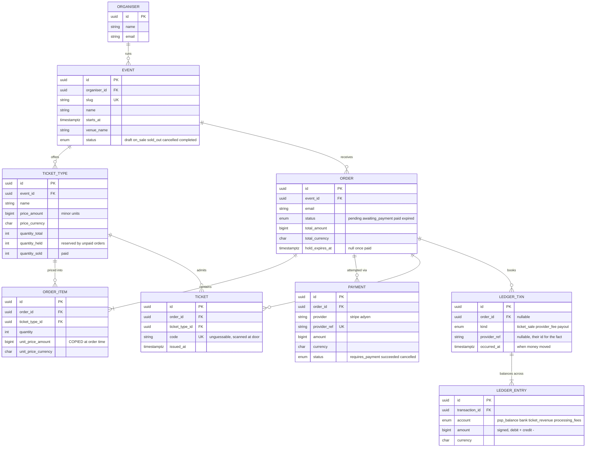
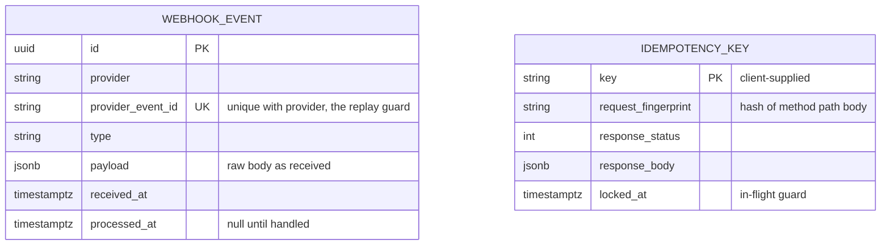
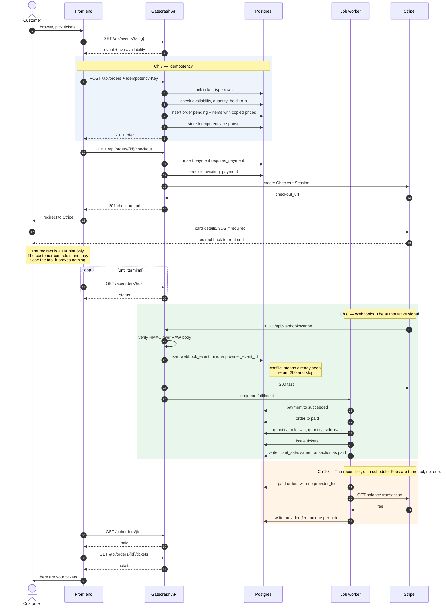
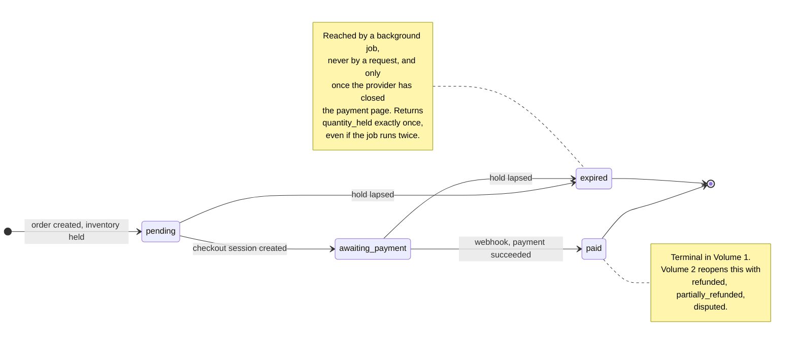

# Gatecrash at a glance

The pictures that go with [`DOMAIN.md`](DOMAIN.md): how the models relate, one
payment from click to ledger, and the order lifecycle. `DOMAIN.md` is the
field-level spec; this is the picture.

## Model relationships

Two tables sit deliberately **outside** the graph, with no foreign keys to anything:

They are infrastructure, not domain. `WEBHOOK_EVENT` is a log of what the provider told
us, kept verbatim so we can replay history and settle arguments; `IDEMPOTENCY_KEY` is a
response cache. Giving either a foreign key into `ORDER` is tempting and wrong — both
must be writable *before* we know whether the thing they refer to exists or is valid.

**Reading the cardinalities**, three are load-bearing and worth stating plainly:

- `ORDER ||--o{ PAYMENT` — one order, **many** payment attempts, one per provider
  session. A customer who leaves the payment page and comes back is two payments and
  one order. A declined card retried on the same Checkout page is not: that happens
  inside one session.
- `TICKET_TYPE ||--o{ ORDER_ITEM` exists only to identify *which* tier was bought. The
  price is copied onto `ORDER_ITEM`, never read back through this edge.
- `ORDER ||--o{ LEDGER_TXN` is a `ticket_sale` at fulfilment and a `provider_fee`
  when the reconciler books it; refunds add reversing transactions later. The ledger
  is append-only — a correction is a new transaction, never an edit.

## The core flow

Everything Volume 1 teaches, in one picture. The two boxed notes are the chapters
readers most often get wrong.

Note what does **not** appear: no path from the customer's redirect to `order = paid`.
Fulfilment hangs entirely off the webhook. That separation is the single most important
structural idea in Volume 1, and it is why chapters 8, 9 and 10 exist.

## Order lifecycle

There is no `failed`. Under hosted Checkout a declined card never reaches us as a state
change: the customer sees the decline on the provider's page and tries another card in
the same session. An order whose customer gives up is one whose hold lapses, and the
clock expires it like any other.
